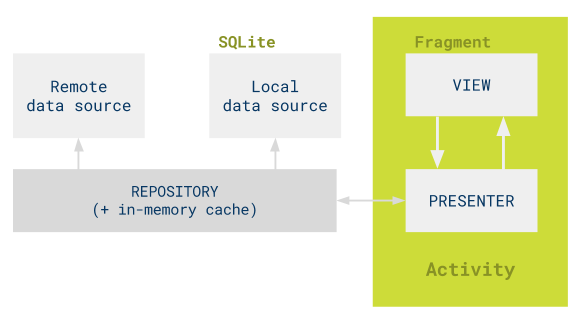

# ASportClient说明

#### 项目介绍
一个校园区app。
#### [app主页](https://liubailin2017.github.io/2018/06/16/my-shool-main-page/)

#### 软件架构

[参考](https://github.com/googlesamples/android-architecture/tree/todo-mvp/)

#### 说明
关于7f700b0提交的说明：
    高德地图的key需要自己申请，一个key对应一个apk的签名，因此需要自己去申请key
参考：[如何获取key](http://lbs.amap.com/api/android-sdk/guide/create-project/get-key)
#### 技术栈
[fastjson](https://gitee.com/wenshao/fastjson)
okhttp
高德地图sdk
#### 开发者
1. [刘柏麟](https://gitee.com/liubailin2017)   [Home](https://liubailin2017.github.io/)

[服务器地址](https://gitee.com/liubailin2017/comm)